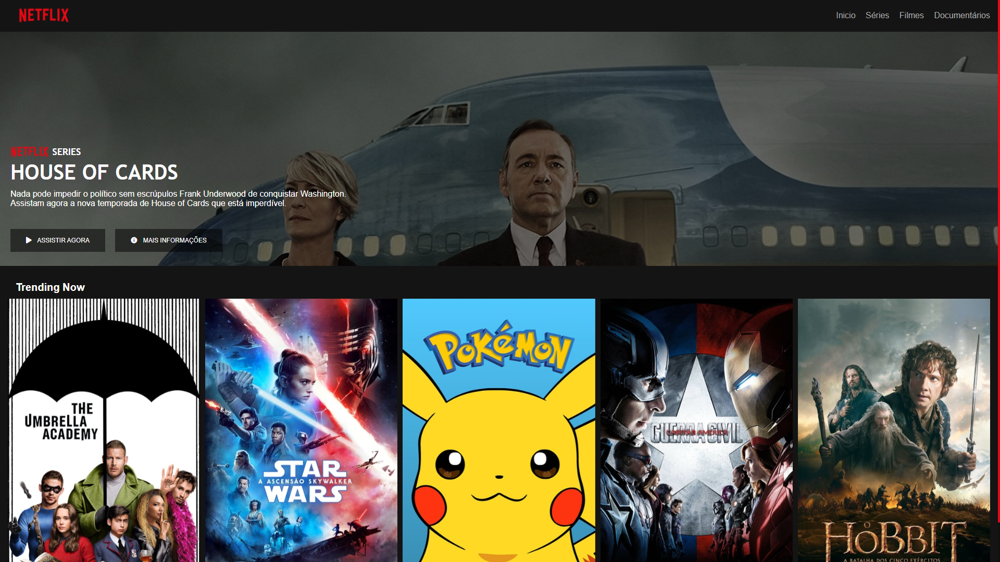

<h1 align="center">Welcome to netflix-html-css-interface 👋</h1>

  

> Projeto feito no Bootcamp Angular Developer da Avanade na Plataforma da Digital Innovation One

## Author

👤 **math3ussdl**

* Website: https://www.gitshowcase.com/kowalsk1-wq
* Github: [@math3ussdl](https://github.com/math3ussdl)
* LinkedIn: [@hugo-lima-78410a194](https://linkedin.com/in/hugo-lima-78410a194)

## Show your support

Give a ⭐️ if this project helped you!

***
_This README was generated with ❤️ by [readme-md-generator](https://github.com/kefranabg/readme-md-generator)_